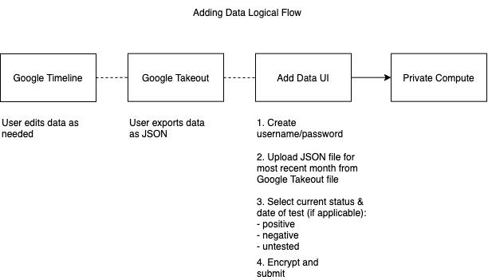

# covid-self-reporting
Privacy preserving voluntary Covid-19 self-reporting platform. Share your (encrypted) location history and test status, get a notification if you have had been in proxmity to a higher risk regions. 

## Overview & Motivation
Social contact tracing based on mobile phone data has been used to track and mitigate the spread of COVID-19[[1]](https://www.nature.com/articles/d41586-020-00740-y). However, this is a significant privacy risk, and sharing this data may disproportionately affect at-risk populations, who could be subject to discrimination and targeting. In certain countries, obtaining this data en masse is not legally viable. 

We propose a privacy-preserving, voluntary self-reporting system for sharing detailed location data amongst individuals and organizations. Users will be able to encrypt and share complete location history, and their current status (positive, negative, unknown). Users will be able to update their status if it changes. This system will compute on shared, aggregate data and return location-based social contact analytics. 

This system relies on 3 core services:

### Location History data from Google Location Services via Google Takeout

Any user who has Location Services active with google is able to obtain a JSON format file of their location history. They are also able to edit this file manually to remove any unwanted or sensitive locations (i.e., a home address). A user who does not use Location Services can manually add a history via Google. 

### A Privacy-preserving Computation service

Private computation is a term for performing tasks on data that is never viewed in plaintext. Our system will use private computation to generate individual and global analytics. In this scenario, private computation techniques could be employed to:
- Identify users who have been in close proximity with individuals who have tested positive
- Add noise to user locations, and then output that data to a map without revealing the original data to anyone, including application developers or server owners
- Analyse and create clusters from user data, and output those results to a map without revealing original data to anyone
TBD (we welcome suggestions for computational analysis that provides privacy guarantees as well as useful, high-fidelity output data)
- We propose using an Intel-SGX based service that uses [Trusted Execution Environments ](https://software.intel.com/en-us/sgx/details) (TEE). Additional private compute techniques include homomorphic encryption, multiparty computation, and differential privacy.

### Visualization and notification services

Our working assumption is to:
- inform individuals who have been in close proximity of individuals who have tested positive via a notification system. This section is TBD based on requirements defined by experts
- create a visualization service for users (individual and social organizations) to track the current status virus outbreak at a granular level. 

This diagram provides an overview of how these services connect and how data is accessed and controlled throughout. Note: data is encrypted on the client side, remains encrypted in transit, and is protected by TEE guarantees during compute. 

[DIAGRAM TK]

## Get Involved

## User Story

## System Architecture

## Components

## Reference

