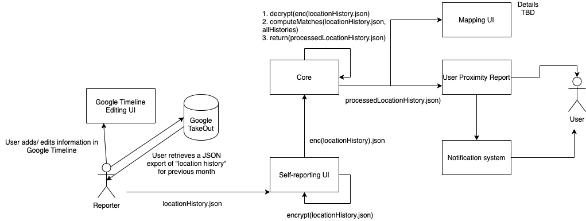
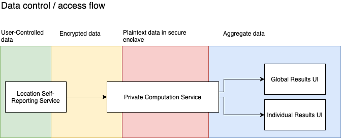

# COVID-19 Self-reporting with Privacy
Privacy preserving voluntary Covid-19 self-reporting platform. Share your (encrypted) location history and test status, get a notification if you have had been in proxmity to a higher risk regions. 

## Overview & Motivation
Social contact tracing based on mobile phone data has been used to track and mitigate the spread of COVID-19[[1]](https://www.nature.com/articles/d41586-020-00740-y). However, this is a significant privacy risk, and sharing this data may disproportionately affect at-risk populations, who could be subject to discrimination and targeting. In certain countries, obtaining this data en masse is not legally viable. 

We propose a privacy-preserving, voluntary self-reporting system for sharing detailed location data amongst individuals and organizations. Users will be able to encrypt and share complete location history, and their current status (positive, negative, unknown). Users will be able to update their status if it changes. This system will compute on shared, aggregate data and return location-based social contact analytics. 

This system relies on 3 core services:

### Location History data from Google Location Services via Google Takeout

Any user who has Location Services active with google is able to obtain a JSON format file of their location history. They are also able to edit this file manually to remove any unwanted or sensitive locations (i.e., a home address). A user who does not use Location Services can manually add a history via Google. 

***note: This service could be swapped/replaced by a mobile application at some point***

### A Privacy-preserving Computation service

Private computation is a term for performing tasks on data that is never viewed in plaintext. Our system will use private computation to generate individual and global analytics. In this scenario, private computation techniques could be employed to:
- Identify users who have been in close proximity with individuals who have tested positive
- Add noise to user locations, and then output that data to a map without revealing the original data to anyone, including application developers or server owners
- Analyse and create clusters from user data, and output those results to a map without revealing original data to anyone
TBD (we welcome suggestions for computational analysis that provides privacy guarantees as well as useful, high-fidelity output data)
- We propose using an Intel-SGX based service that uses [Trusted Execution Environments ](https://software.intel.com/en-us/sgx/details) (TEE). Additional private compute techniques include homomorphic encryption, multiparty computation, and differential privacy.

### Visualization and notification services

Our working assumption is to:
- inform individuals who have been in close proximity of individuals who have tested positive via a notification system. This section is TBD based on requirements defined by experts
- create a visualization service for users (individual and social organizations) to track the current status virus outbreak at a granular level. 

These diagrams provides an overview of how these services connect and how data is accessed and controlled throughout. Note: data is encrypted on the client side, remains encrypted in transit, and is protected by TEE guarantees during compute. 

## User Story

1. User creates an account (email and password)
2. User views instructions for retrieving location data from Google Location services. 
3. User reviews Google Maps timeline, and optionally removes any sensitive activity (i.e., home address, work address, others)
4. User exports her data via Google Takeout service
5. User returns to app UI and uploads JSON file from Google Takeout for the previous month / 2 months
6. User indicates her current testing status (positive, negative, untested) and the date of the test (today's date if untested)
7. User submits data to compute service (data is encrypted locally by the app prior to sending)
8. User can now view "matches", where her data overlaps in time and proximity to a user reporting a positive test result
9. User will receive emails if new matches occur, and prompting her to update her data and infection status periodically. 

## System Architecture

## Components

### Data self-reporting UI
**Requirements:**
- Clearly communicates to users the risks and objectives of the service
- Walks users through obtaining and sanitizing Google Takeout location data
- Provides https-like assurances that UI is in communication with successfully attested enclave
- Enables users to create a persistent email/password log-in
- Enables users to submit, and update:
    - 1-2 months of location history in Google Takeout JSON format
    - Current infection status (positive, negative, untested)
    - Date test was administered
**Open Questions**
What are our options for data validation?

### Private compute
**Requirements:**
- Proves what code is being executed over the data
- Proves integrity via Intel Attestation Service (IAS)

Input:
Encrypted user location histories in Google Takeout JSON format

Output:
Positive matches between users who have had positive test results and users who overlapped with them on time and proximity 

Open Questions

### Post-Compute Results
Current thinking is to have two services result from the computation:
- A notification service for users who are untested/negative that tells them if they have overlapped in time/proximity with positive test cases [Link to detailed description]
- An aggregate heatmap of locations where individuals with positive tests have been [Link to detailed description]

Open Questions

## Reference

## Get Involved
Below is a list of areas that we need help with and our open questions
- Epidemiologists / public health: 
We need to solicit feedback on how this data is most actionable both for individuals and also the society at large. The goal of individual reporting is to assess situations of close proximity to high risk individuals. This enables us to take better measures. We need feedback to understand what distance and time difference should trigger a high risk scenario (i.e 2 individuals within 10ft in a 1 day window can infect one another). We also would welcome feedback on our approach to global view visualizer. Please see issues X and Y that explain these asks in more detail.

- Rust programmers, developers and engineers with Intel SGX experience
TBD - Enigma team is currently volunteering to lead this part. We would always welcome more hands

- Mapping/visualization and experience working with Google Location data:  

- Notification / alert system:
We would like individuals who opt in to receive emails (or other forms of notification like text) if they are found to be in a high risk area. We need help implementing the notification system. Please see the following issue for more details

- Data privacy (i.e., able to identify data leakage concerns / mitigations)

- Front-end design
Front-end development for self-reporting UI 

- Devops

- Volunteers to provide sample data:
Our proposal only provides value if volunteers participate. We welcome everyone who’s tested for Covid-19 to share their location history in a privacy preserving manner when we have an initial prototype

